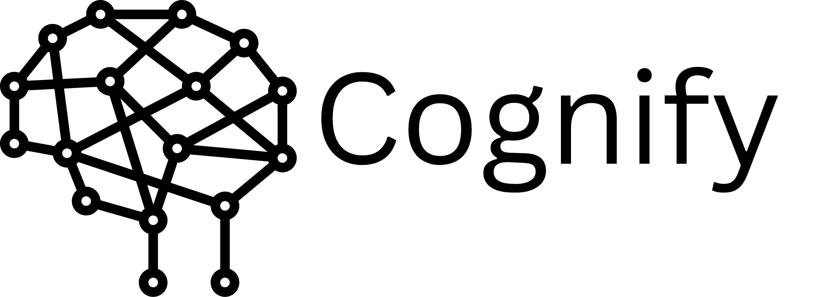

# Cognify

<!---->
<!---->

Cognify is a cloud-based AI system developed as a University Final Year Project. It utilises deep learning techniques to analyse MRI images and detect signs of Alzheimer’s Disease (AD). This web application enables users to log in, create patient profiles, and upload MRI session scans. Users can attach notes, apply trained models to generate predictions, and compare MRI images from different timeframes, assisting in the diagnosis and monitoring of Alzheimer’s Disease.

## Features

| Feature                    | Status         |
| -------------------------- | -------------- |
| **User Authentication**    | 🔄 In Progress |
| **Patient Profiles**       | 🔄 In Progress |
| **MRI Upload & Storage**   | ❌ Not Started |
| **Linking Trained Models** | ❌ Not Started |
| **Notes & Annotations**    | ❌ Not Started |
| **Timeframe Comparisons**  | ❌ Not Started |

<!-- //🔄 In Progress | ✅ Completed |  ❌ Not Started-->

## Contributing

Contributions are welcome! Please feel free to submit a Pull Request.

## License

This project is licensed under the GNU General Public License v3.0 (GPLv3).  
You can read the full terms in the [LICENSE](./LICENSE) file.
